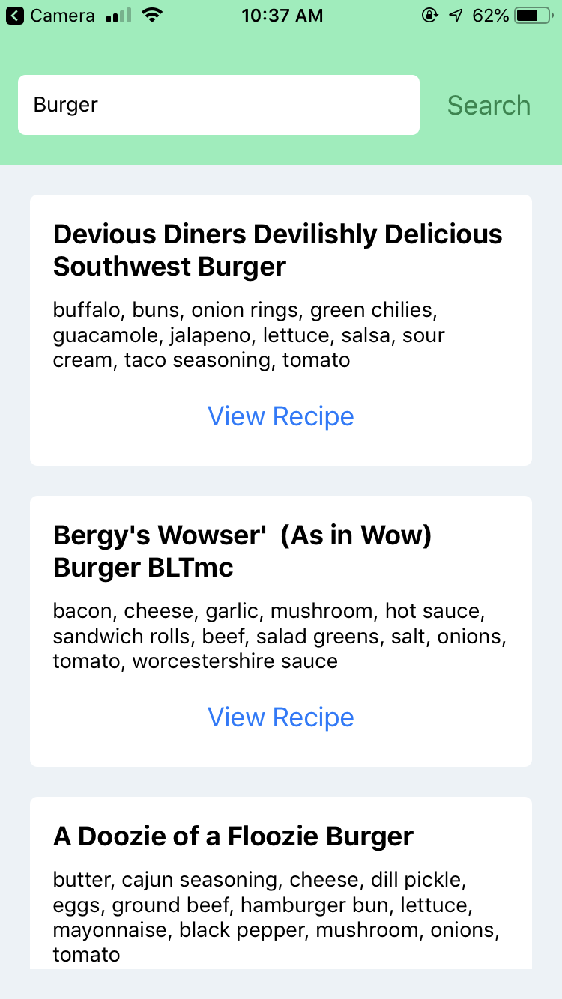
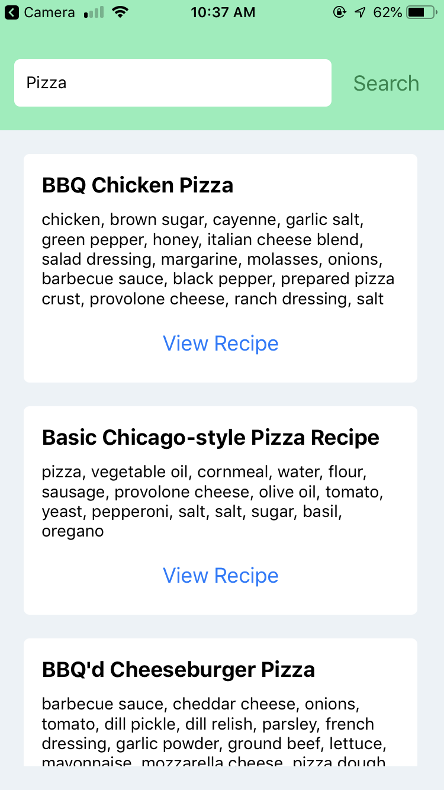

# LavaLab React Native Workshop

Hey there! This workshop was made for LavaLab to teach developers how to use React Native to rapidly build mobile apps using
the popular Javascript framework React.

During this workshop, you'll be building a mobile application that will let you search for recipes via public API (Recipe Puppy).
The app will then display results in a nice list with links to recipes related to the given search input.

*Link to slides:* https://docs.google.com/presentation/d/1AeVscAC5sdwZhaVPWyj5q5tmVf-v57dEO_n8wibHNLw/edit?usp=sharing 



## Learning Outcomes

* Understand how React Native works and the general development workflow
* Understand how data is passed in React
* Learn how to use React Native components
* How to interface with external APIs through `fetch`

## Pre-Requisites

* Install Node.js and NPM on your computer (https://nodejs.org/en/)
* Install expo-cli on the command line by running `npm install -g expo-cli`
* Download the Expo mobile app so you can test your app on your mobile device (https://expo.io/)
* Optional: Install an Android or iOS simulator. If you download Expo on your phone you should be good but if you prefer, you can use a simulator

This workshop is meant to be beginner friendly but some development experience is expected. Bigger plus if you have experience with React (web) or general HTML/CSS.

## Navigating this workshop

The completed source code for this application is included in this repository. However, I'll walk you through building this app from scratch, all the way from the command line to writing the actual code.

## Project Set up

One of the pre-requisites told you to install expo-cli and install the application on your phone. Expo is a super helpful tool that bridges the gap
between your computer and your mobile device. Expo will handle compiling your code and communicating with your phone so you can code and test without
needing to plug in a device! First though, we need to create an Expo/React Native project.

* Run `expo init recipe-search` into a folder of your choice. This will create a folder called `recipe-search` that will contain the boilerplate React Native code for your application
  * When prompted, select the "blank" template -- this will create a barebones React Native app that we'll build on top of
* Run `cd recipe-search` then `expo start` -- this will start your application via Expo so you can access the app on your mobile device. A web page will open up with a QR code. Scan this on your phone so you can open the app via the Expo app
* (Optional) if you prefer, there will be an option to open the app via an Android or iOS simulator. If you decide to go the simulator route, this is available

At this point, you should see a very basic mobile application on your phone. Open up the `recipe-search` folder onto the text editor of your choice. We will begin grinding out code and making our recipe search app!

## Basic interface

First, let's look at the boilerplate provided. You will see a `<View>` tag and a `<Text>` tag in the render function. React Native uses JSX, which allows us
to embed HTML-like syntax into Javascript code. The render() function tells React Native how to render the component. Essentially right now, our app is one big React component. You can think of the `<View>` tag like HTML's `<div>` but specific for React Native. Likewise, you can imagine `<Text>` as a `<p>` or `span` tag. If you change anything inside the `<Text`> tag, Expo will reload the code, re-build it, and update it on your phone or simulator.

Let's start putting together a very basic interface for our application. We want a text input box and a "search" button.

To do this, go to line 2 and change it to the following:

```javascript
import { StyleSheet, Text, View, TextInput, Button } from 'react-native';
```

We're telling React Native to import the `TextInput` and `Button` components, native components that allow us to gather text input and respond to user clicks/touches. Let's add the following code to our `render()` function (right under the `<Text>` code):

```jsx
<TextInput value="Burger" style={{height: 40, width: 200, borderColor: 'gray', borderWidth: 1}} />
<Button title="Search" />
```

Your app will refresh and you should see a text input box and a search button. We added some `style` to the TextInput component by passing a prop. This prop is an object with rules defining the style of the TextInput component. Does it remind you of CSS?? React Native styles are very similar to CSS so you can do things like set margin, padding, height, width, and more using this style prop. Read more here: https://facebook.github.io/react-native/docs/style (We'll dive into styles later)

If you try changing the text input, it'll reset to "Burger". In addition, pressing "Search" will not do anything. To make our TextInput dynamic, we need to tie it to our App component's state. In addition, we'll define a method that will be called when the "Search" button is pressed.

First, let's tackle the TextInput so that it is tied to a dynamic state.

Add this method to the App component class

```jsx
constructor(props) {
  super(props); // Required

  // Set our components state (data that we want to manage for this App component)
  this.state = {
    searchQuery: '',
    recipes: []
  };
}
```

This is the constructor for our App component class. This will let us initialize the internal state for our component. An app's state is stored as a Javascript object which we can manipulate using a `setState` function (more on this in a bit). We define 2 variables in our state: a searchQuery string and a recipes array (we'll be using the recipes array later to store data from our Recipe Puppy API). Now that we've defined a searchQuery variable in our state, let's work on our `TextInput` component so that is tethered to this state.

Change the `TextInput` component in your `render()` function to the following:

```jsx
<TextInput
  style={{height: 40, width: 200, borderColor: 'gray', borderWidth: 1}}
  onChangeText={(searchQuery) => this.setState({searchQuery: searchQuery})}
  value={this.state.searchQuery}
/>
```

Instead of our hardcoded "Burger" value, our TextInput will render whatever is stored in `searchQuery`. The `onChangeText` is a prop for the TextInput component that dictates what to do when text is updated. When this function is called, it passes the new text input as a parameter. Then, we call `this.setState({searchQuery: searchQuery})`. This will tell our App component to update our internal state so that the new `searchQuery` is whatever we've inputted into the text box. Why do we not just call `this.state.searchQuery = searchQuery`? `this.setState()` is used by React to keep track of changes to the state so that it knows to re-render the component. Now, if you save and check the app, you should be able to edit that text box.

Let's go ahead and add an action to our search button. Under the `constructor` method, add this to your `App` class:

```jsx
/*
  Internal method used to hit our Recipe Puppy API and update our state
*/
fetchRecipes = () => {
  console.log("Button pressed");
}
```

Next, change the `Button` line so that it looks like the following:
```jsx
<Button title="Search" onPress={this.fetchRecipes} />
```

Save your code. What we did was pass the `fetchRecipes` function as a prop to our `Button` component. `Button` will call the `onPress` prop whenever it is pressed. If you check the app in Expo, when you click "Search", you will see a message in your terminal! Soon we will link this to code that will retrieve data from Recipe Puppy.

So sweet! At this point, we've built a very basic mobile app that takes text input and prints a message to console.. not that exciting but at least you've dipped your toes into how React works. Now, let's write some code so that our Search button will retrieve data from the internet.

## Hitting an API

First, let's delete the `<Text>` tag in our `render()` function. We're past boilerplate code now, let's get our hands dirty. Change our `fetchRecipes` method so that it looks like the following:

```jsx
/*
  Internal method used to hit our Recipe Puppy API and update our state
*/
fetchRecipes = () => {
  // Hides the keyboard (if it's up)
  Keyboard.dismiss();

  // Store the state's searchQuery into a convenient variable
  const searchQuery = this.state.searchQuery;

  // Hit our Recipe Puppy API w/ some parameters
  // Converts the response from JSON to an object and stores it in our state
  fetch(`http://www.recipepuppy.com/api/?q=${searchQuery}&p=1`)
    .then(response => response.json())
    .then(data => {
      console.log(data.results);

      this.setState({
        recipes: data.results
      })
    });
}
```

Next, change line 2 to the following:

```javascript
import { StyleSheet, Text, View, TextInput, Button, Keyboard } from 'react-native';
```

Let's break down what we've added. In our `fetchRecipes` method, first we will dismiss the Keyboard. We had to import the `Keyboard` module to do this but this is a piece of code that will hide the keyboard if it's up.

Next, we get the `searchQuery` data stored in our apps state.

Next, we use the built-in `fetch` method to hit a public REST API provided by Recipe Puppy. It takes a simple query parameter (and page parameter) and returns JSON data. Fetching data over the internet is an asynchronous process so we need to write some code to deal with this in a synchronous manner.

This is done in Javascript through promises (https://developers.google.com/web/fundamentals/primers/promises). Fetch returns a Promise with JSON text data. Then we use another promise (`json()`) to convert that JSON text data to a Javascript object. Our final link in the Promise chain will store the parsed data into our app's state.

I added a `console.log` statement so you can see this JSON data in console when you press search. Now save and check Expo. Enter in something like "rice" and click "Search". Nothing will happen visually but if you check your Terminal/console, you will see JSON output! We're hitting an external web API and can do stuff with this data now!

## Intro to Lists

Great. We have this data in our application. But it means nothing if we can't render it to our user! Introducing: the FlatList component. This is a component that React Native supplies that allows us to render a basic list with items. React Native makes it super easy to render these lists so let's dive into it.

First, change line 2 to the following (note that we're adding `FlatList` and `Linking` to our import list)

```javascript
import { StyleSheet, Text, View, TextInput, Button, Keyboard, FlatList, Linking } from 'react-native';
```

Next, let's add the following method to our App class:

```jsx
/*
  Method that we pass as a prop to our FlatList
  Given a Javascript object, tells our FlatList component how to render each item
*/
renderRecipe = (recipe) => {
  return (
    <View>
      <Text>{recipe.item.title}</Text>
      <Text>{recipe.item.ingredients}</Text>

      <Button
        title="View Recipe"
        onPress={() => {
          Linking.openURL(recipe.item.href);
        }}
      />
    </View>
  )
}
```

This is a method that will be used by our FlatList component to render each item in our `recipes` array. We'll pass this method to our `FlatList` component which will render a `<View>` tag for each item. It takes a parameter (recipe) which is the JS object for each individual item.

In addition, we need a keyExtractor method. Add this method to our App class:

```jsx
/*
  In React, if an item is part of an array and is being rendered, it needs a unique key to make sure
  updates like delete are properly handled. Keys are supposed to be unique (so like an Id or something like that)
  but in this case, we'll make the key the index it appears in the array plus the item's title (should be unique enough)
*/
keyExtractor = (item, index) => {
  return index + '-' + item.title;
}
```

React requires each item to have a unique key if it's part of an array and being iteratively rendered. Usually this is something like an item ID but our API doesn't return that so we make the key for each item the index + the item's title (this should be unique enough)

Now, let's add our FlatList component to our `render()` function. Add the following to the render:

```jsx
<FlatList data={this.state.recipes} renderItem={this.renderRecipe} keyExtractor={this.keyExtractor} />
```

Save your code and wait for Expo to reload. Now when you tap your text box, enter text, and click search.. you should see a list of items. Each item will also have a button that when pressed, opens up your phone's browser.

So sick! At this point, we've built a basic application that takes input, gets data from the internet, and renders that data in a list. However, the app doesn't look that great. In the next optional section, we'll be adding some styles to our code so that it looks a little bit better and more like a natural mobile application.

## Styling (Optional)

Copy and paste the following stylesheet to replace the `styles` variable in your code. Take a look at how the styles are written so you understand how styling works in React Native.

```javascript
/*
  React Native stylesheets work very similarly to CSS styles
  I highly recommend looking into flexbox and how it works because it helps out a lot w/ layouts
*/
const styles = StyleSheet.create({
  container: {
    backgroundColor: '#ECF2F6',
    alignItems: 'flex-start',
    flexDirection: 'column',
    justifyContent: 'flex-start',
    height: '100%'
  },
  searchBar: {
    backgroundColor: '#87EFB8',
    width: '100%',
    flexGrow: 0,
    paddingTop: 50,
    paddingBottom: 20,
    paddingLeft: 20,
    paddingRight: 20,
    alignItems: 'center',
    flexDirection: 'row',
    justifyContent: 'center',
    alignItems: 'center'
  },
  searchBox: {
    height: 40,
    backgroundColor: '#fff',
    borderRadius: 5,
    padding: 10,
    marginRight: 10,
    flexBasis: '80%'
  },
  recipeList: {
    flex: 1,
    paddingBottom: 20
  },
  item: {
    padding: 15,
    marginLeft: 20,
    marginRight: 20,
    marginTop: 20,
    borderRadius: 5,
    backgroundColor: '#fff'
  },
  title: {
    fontWeight: 'bold',
    fontSize: 18,
    marginBottom: 10
  },
  ingredients: {
    marginBottom: 10
  }
});
```

I decided to make this a bit easier for you all so we don't spend time hand writing these styles! Now let's apply these styles to our app component.

First, let's add styles for our search bar. Replace your `TextInput` and `Button` code with the following:

```jsx
<View style={styles.searchBar}>
  <TextInput
    style={styles.searchBox}
    onChangeText={(searchQuery) => this.setState({searchQuery: searchQuery})}
    value={this.state.searchQuery}
  />

  <Button title="Search" onPress={this.fetchRecipes} color='#17864B'></Button>
</View>
```

We wrapped our TextInput and Button inside a `View` (which is like a div tag). We applied a `searchBar` style to our View and a `searchBox` style to our search box.

Now, let's style our list and the list items. We want to wrap our `FlatList` inside a `View` so that the code looks like the following:

```jsx
<View style={styles.recipeList}>
  <FlatList data={this.state.recipes} renderItem={this.renderRecipe} keyExtractor={this.keyExtractor} />
</View>
```

Next, let's style our items by changing the `renderRecipe` method. Change the code so that your `renderRecipe` looks like the following:

```jsx
/*
  Method that we pass as a prop to our FlatList
  Given a Javascript object, tells our FlatList component how to render each item
*/
renderRecipe = (recipe) => {
  return (
    <View style={styles.item}>
      <Text style={styles.title}>{recipe.item.title}</Text>
      <Text style={styles.ingredients}>{recipe.item.ingredients}</Text>

      <Button
        title="View Recipe"
        onPress={() => {
          Linking.openURL(recipe.item.href);
        }}
      />
    </View>
  )
}
```

Note that we just tacked onto some styles to change the text size, container look, and spacing. Now when we check the app, it looks a lot nicer and looks/feels like a natural mobile application!



## Wrapping Up

Now, you're app should respond to user input, hit a REST API, and display results in a nice list component. That wraps up this React Native workshop. I hope you enjoyed building this application and learned how React + React Native can be used to build mobile applications.

## Further Reading

* https://reactnavigation.org/
* https://facebook.github.io/react-native/docs/getting-started.html
* https://facebook.github.io/react-native/docs/tutorial
* https://survivejs.com/react/getting-started/understanding-react-components/
